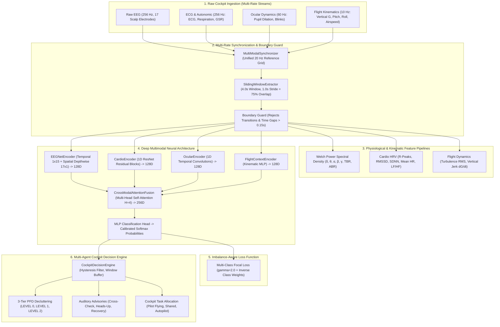

# Engineering & Architecture Project Documentation
## Real-Time Multimodal Pilot Cognitive & Physical Workload Prediction and Cockpit Display Decluttering Platform

---

### Executive Metadata
* **Project Title:** End-to-End Multimodal Platform for Real-Time Pilot Cognitive Workload Prediction and Cockpit Display Decluttering
* **Target Domain:** Avionics AI, Human Factors Engineering, Flight Deck Human-Machine Interaction (HMI)
* **Primary Review Milestone:** Review 1 / Phase 1 & 2 Technical Deliverable
* **Operational Constraint:** Strict Software-Only Implementation (No physical microcontrollers; offline benchmark ingestion simulating real-time telemetry)
* **Real-Time Avionics Constraint:** End-to-end single-window inference latency budget $< 50.0\text{ ms}$
* **Measured Performance:** $p_{50} = 2.78\text{ ms}$, $p_{99} = 3.54\text{ ms}$ ($> 14\times$ safety margin)
* **GitHub Repository:** [https://github.com/AG0606/pilot-workload-engine](https://github.com/AG0606/pilot-workload-engine)
* **Cloud Kaggle Kernel:** [https://www.kaggle.com/code/ag0606/pilot-workload-engine-phase1](https://www.kaggle.com/code/ag0606/pilot-workload-engine-phase1)

---

## 1. Project Background & Problem Statement

### 1.1 The Operational Hazard: Loss of Control In-Flight (LOC-I)
In commercial and military aviation, Loss of Control In-Flight (LOC-I) represents the single most fatal accident category. National Transportation Safety Board (NTSB) and Federal Aviation Administration (FAA) accident investigations reveal that the majority of LOC-I mishaps occur not from primary mechanical breakdowns, but from cognitive failure modes during high-workload, abnormal flight regimes:
1. **Channelized Attention (Tunnel Vision):** The pilot fixates exclusively on a single malfunctioning gauge or checklist step while inadvertently allowing aircraft attitude, airspeed, or altitude to decay.
2. **Diverted Attention (Distraction):** Attention is drawn away from the primary flight trajectory by non-critical cockpit alerts, false warnings, or auxiliary communication tasks.
3. **Startle and Surprise:** An unexpected aerodynamic upset, severe wake turbulence, or sudden instrument failure induces acute neurological shock, freezing pilot motor response or causing abrupt, counterproductive control inputs.

### 1.2 The Cockpit Display Bottleneck
Modern glass cockpits feature Primary Flight Displays (PFD), Navigation Displays (ND), Engine Indicating and Crew Alerting Systems (EICAS), and weather radar. During high-stress regimes, the sheer density of visual symbology compounds cognitive overload. Pilots struggle to locate critical attitude references amidst secondary gauges and warning text.

### 1.3 Project Objective
This project builds an end-to-end software platform that:
1. Ingests heterogeneous multimodal pilot physiological signals and aircraft flight dynamics.
2. Resamples and synchronizes asynchronous multi-rate streams onto a unified master reference grid.
3. Extracts neurological spectral features (Welch PSD) and autonomic metrics (Heart Rate Variability).
4. Employs a specialized deep neural network (spatial-temporal EEGNet + Cardio 1D ResNet + Cross-Modal Multi-Head Attention Fusion) to classify pilot cognitive states in real time.
5. Optimizes training under extreme class imbalance (~$80\%$ Baseline) using Multi-Class Focal Loss.
6. Feeds predictions into a Multi-Agent Cockpit Decision Engine that dynamically executes 3-tier PFD display decluttering, triggers advisory chimes, and reallocates flight tasks within a strict $< 50.0\text{ ms}$ real-time latency envelope.

---

## 2. Cognitive State Taxonomy & Flight Regimes

The system classifies pilot mental state into four discrete categories aligned with standardized aviation psychology benchmarks:

| State Code | Cognitive State | Operational Definition | Cockpit Threat Level | Decision Engine Action |
| :--- | :--- | :--- | :--- | :--- |
| **0** | **Baseline (A)** | Nominal flight cruise conditions; cognitive reserve balanced; low stress. | Nominal (Threat Level 0) | `LEVEL_0_FULL` display; full symbology; `PILOT_FLYING` manual control. |
| **1** | **Channelized Attention (B / CA)** | Cognitive fixation on a single visual instrument or sub-task; failure to scan primary horizon. | Moderate (Threat Level 1) | `LEVEL_1_MODERATE` declutter; suppress secondary gauges; trigger `CROSS_CHECK_CHIME`; `SHARED_COCKPIT` task assist. |
| **2** | **Diverted Attention (C / DA)** | Attention diverted away from primary flight path by secondary alerts, FMC entries, or ATC chatter. | Moderate (Threat Level 1) | `LEVEL_1_MODERATE` declutter; suppress weather/TCAS; trigger `HEADS_UP_CHIME`; advisory scan prompt. |
| **3** | **Startle / Surprise (D / SS)** | Acute neurological panic and sensory disorientation following an abrupt upset or sudden failure. | Critical (Threat Level 2) | `LEVEL_2_ESSENTIALS` declutter ("Basic Six" attitude only); trigger `ATTITUDE_RECOVERY_WARNING`; `AUTOPILOT_AUTO_ASSIST`. |

---

## 3. End-to-End System Architecture



---

## 4. Ingestion Dataset & Multi-Rate Synchronization

### 4.1 Benchmark Dataset Details
* **Dataset Identifier:** Kaggle / NASA *"Reducing Commercial Aviation Fatalities"* benchmark (`train.csv`, $1.23\text{ GB}$).
* **Experimental Protocol:** Real commercial aviation pilots flying high-fidelity simulators under controlled protocol sessions (`1_CA`, `1_DA`, `1_SS`, `2_CA`, etc.).
* **Recorded Channels:**
  * **EEG (17 Channels @ 256 Hz):** `eeg_fp1`, `eeg_f7`, `eeg_f8`, `eeg_t3`, `eeg_t4`, `eeg_t5`, `eeg_t6`, `eeg_t3_2`, `eeg_c3`, `eeg_c4`, `eeg_p3`, `eeg_p4`, `eeg_o1`, `eeg_o2`, `eeg_fp2`, `eeg_fz`, `eeg_cz`.
  * **Autonomic (3 Channels @ 256 Hz):** `ecg` (electrocardiogram), `r` (respiration belt), `gsr` (galvanic skin response).
  * **Ocular (4 Channels @ 60 Hz):** Gaze coordinates $(x, y)$, pupil diameter, and blink flag.
  * **Flight Telemetry (8 Channels @ 10 Hz):** Pitch, roll, yaw rate, vertical load factor ($G_z$), lateral acceleration, airspeed, and altitude.

### 4.2 Mathematical Synchronization Formulation
Cockpit displays refresh at 20–60 Hz. Keeping raw EEG at 256 Hz produces 1,024 points per 4.0-second window, which balloons compute latency. Resampling all signals to a unified **$20\text{ Hz}$ reference grid** ($\Delta t = 0.05\text{ s}$) preserves all cognitive frequency bands up to $10\text{ Hz}$ (covering Theta $4–8\text{ Hz}$ and Alpha $8–13\text{ Hz}$) while slashing tensor size to **80 samples per window** ($> 90\%$ reduction).

For continuous physiological and kinematic signals, linear spline interpolation aligns samples to reference grid $t_{\text{ref}} = [t_0, t_0 + \Delta t, \dots, t_N]$:
\[
x_{\text{aligned}}(t) = x(t_k) + \frac{x(t_{k+1}) - x(t_k)}{t_{k+1} - t_k}(t - t_k), \quad t \in [t_k, t_{k+1}]
\]

For discrete categorical states, nearest-neighbor search prevents the introduction of artificial floating-point label artifacts:
\[
s_{\text{aligned}}(t) = s\left(\arg\min_{k} |t - t_k|\right)
\]

### 4.3 Boundary & Discontinuous Gap Guard
Flight simulator logs contain multiple independent experimental sessions where timestamps reset to 0. Concatenating raw records naively causes severe interpolation distortion and cross-session data leakage.

The `SlidingWindowExtractor` enforces strict continuity constraints:
1. **Session Integrity:** Every time step within window $[t_{\text{start}}, t_{\text{start}} + 4.0\text{s}]$ must belong to the exact same compound key $(\text{crew\_id}, \text{experiment}, \text{seat})$.
2. **Gap Detection:** If any internal time step gap exceeds $\Delta t_{\text{max}} = 0.15\text{ s}$, the window is rejected:
\[
\text{Reject window if } \max_{k} (t_{k+1} - t_k) > 0.15\text{ s} \quad \lor \quad |\text{unique}(\text{session\_keys})| > 1
\]

---

## 5. Domain-Specific Feature Engineering

While the deep neural network performs end-to-end representation learning, our pipeline extracts classical biomedical features to provide interpretability and baseline benchmarking:

### 5.1 Welch Power Spectral Density (PSD) & Cognitive Ratios
Using Welch's average periodogram with Hann windowing, power spectral density $P_{xx}(f)$ is integrated over the classical neurological bands:
\[
P_{\text{band}} = \int_{f_{\text{low}}}^{f_{\text{high}}} P_{xx}(f) \, df
\]
* **Delta ($\delta$):** $0.5 - 4.0\text{ Hz}$ (deep rest / slow wave)
* **Theta ($\theta$):** $4.0 - 8.0\text{ Hz}$ (mental fatigue / working memory load)
* **Alpha ($\alpha$):** $8.0 - 13.0\text{ Hz}$ (vigilance / relaxed alertness)
* **Beta ($\beta$):** $13.0 - 30.0\text{ Hz}$ (active attention / cognitive processing)
* **Gamma ($\gamma$):** $30.0 - 45.0\text{ Hz}$ (multimodal cognitive binding)

**Cognitive Workload Indices:**
* **Theta-to-Beta Ratio (TBR):** Reflects executive attention depletion:
  \[
  \text{TBR} = \frac{P_\theta}{P_\beta + \epsilon}
  \]
* **Alpha-to-Beta Ratio (ABR):** Reflects cortical arousal and vigilance:
  \[
  \text{ABR} = \frac{P_\alpha}{P_\beta + \epsilon}
  \]

### 5.2 Autonomic Heart Rate Variability (HRV)
From raw ECG waveforms, R-peak detection computes the sequence of successive normal-to-normal inter-beat intervals $RR_i$ in milliseconds:
* **Mean Heart Rate:**
  \[
  \overline{\text{HR}} = \frac{60000}{\frac{1}{N}\sum_{i=1}^N RR_i}
  \]
* **SDNN (Standard Deviation of NN Intervals):** Overall autonomic nervous system regulatory capacity:
  \[
  \text{SDNN} = \sqrt{\frac{1}{N-1}\sum_{i=1}^N (RR_i - \overline{RR})^2}
  \]
* **RMSSD (Root Mean Square of Successive Differences):** Parasympathetic / vagal tone indicator:
  \[
  \text{RMSSD} = \sqrt{\frac{1}{N-1}\sum_{i=1}^{N-1} (RR_{i+1} - RR_i)^2}
  \]
* **LF/HF Spectral Ratio:** Low frequency ($0.04 - 0.15\text{ Hz}$) to high frequency ($0.15 - 0.40\text{ Hz}$) power ratio via Lomb-Scargle periodogram, measuring sympathovagal balance during stress.

### 5.3 Flight Kinematics & Jerk
* **Vertical Jerk ($dG/dt$):** First derivative of vertical acceleration, isolating sudden turbulence or violent aerodynamic buffeting from steady G-loads.
* **Turbulence RMS Intensity:** Root-mean-square of vertical acceleration fluctuations:
  \[
  \text{Turbulence}_{\text{RMS}} = \sqrt{\frac{1}{S}\sum_{k=1}^S (G_{z, k} - \overline{G_z})^2}
  \]

---

## 6. Deep Neural Architecture (`MultiModalWorkloadClassifier`)

```
                           INPUT SLIDING WINDOW (4.0s @ 20 Hz = 80 SAMPLES)
         ┌─────────────────────────┬─────────────────────────┬─────────────────────────┐
         ▼                         ▼                         ▼                         ▼
   EEG [17 x 80]            Cardio [3 x 80]           Ocular [4 x 80]           Context [8 x 80]
         │                         │                         │                         │
   EEGNetEncoder             CardioEncoder             OcularEncoder         FlightContextEncoder
  (Temporal Conv 1x15)      (1D ResNet Blocks)      (1D Temporal Conv)       (Linear Projection)
  (Depthwise Conv 17x1)     (Conv1D + BatchNorm     (Conv1D + BatchNorm      (BatchNorm + LeakyReLU)
  (Separable Conv)           + Skip Connection)      + MaxPool)                        │
         │                         │                         │                         │
    Embed [128]               Embed [128]               Embed [128]               Embed [128]
         └─────────────────────────┼─────────────────────────┴─────────────────────────┘
                                   ▼
                       Modality Token Stacking [B, 4, 128]
                                   +
                       Learnable Modality Positional Embeddings
                                   │
                                   ▼
                       CrossModalAttentionFusion
                    (Multi-Head Self-Attention H=4)
                    (LayerNorm + Residual Connection)
                    (Feed-Forward Network + LayerNorm)
                                   │
                                   ▼
                       Pooled Representation [B, 256]
                                   │
                                   ▼
                        Classification MLP Head
                    (Linear 256 -> 64 -> BatchNorm -> Dropout -> Linear 64 -> 4)
                                   │
                                   ▼
                    Calibrated Probabilities [P0, P1, P2, P3]
```

### 6.1 EEGNet Spatial-Temporal Encoder
* **Stage 1 (Temporal Filtering):** 1D convolution along the time dimension ($1 \times 15$, kernel size $15$, $8$ filters) learning frequency band filters directly from data.
* **Stage 2 (Spatial Depthwise Filtering):** Depthwise spatial convolution across all $17$ electrode leads ($17 \times 1$, depth multiplier $2$, $16$ filters). This models instantaneous cross-scalp potential differences without mixing temporal dynamics.
* **Stage 3 (Separable Convolution):** Separable 1D convolution ($1 \times 16$) followed by Exponential Linear Unit (ELU), average pooling ($1 \times 4$), and dropout ($p=0.25$). Output projected to $D=128$.

### 6.2 Cardio ResNet Encoder (1D Residual Architecture)
Extracts autonomic features from 3 channels (`ecg`, `respiration`, `gsr`). Consists of two stacked `CardioResidualBlock1D` modules with skip connections:
\[
\mathbf{y} = \text{LeakyReLU}\left(\mathbf{x} + \mathcal{F}(\mathbf{x}, \{W_i\})\right)
\]
Skip connections prevent vanishing gradients when learning subtle heartbeat interval perturbations, projecting to $D=128$.

### 6.3 Cross-Modal Multi-Head Attention Fusion
* **The Engineering Rationale:** Human physiology is context-dependent. A sudden spike in heart rate during a 3G high-speed turn is a natural physical reaction to mechanical load factor. The exact same heart rate spike during straight-and-level flight indicates severe panic or acute mental stress. Simple vector concatenation cannot dynamically weigh these interactions.
* **Mechanism:** The four $128$-dimensional modality vectors are augmented with learnable modality embeddings into a token sequence $\mathbf{Z} \in \mathbb{R}^{B \times 4 \times 128}$.
* **Multi-Head Self-Attention ($H=4$, $d_k=32$):**
  \[
  \text{Attention}(Q, K, V) = \text{softmax}\left(\frac{QK^T}{\sqrt{d_k}}\right)V
  \]
* Followed by Layer Normalization, multi-layer perceptron refinement, and flattened projection to $D_{\text{fused}}=256$.

---

## 7. Optimization & Class Imbalance Strategy

### 7.1 The Class Imbalance Problem
In realistic aviation operations, pilots spend approximately $80\%$ of their flight time in the nominal Baseline state. A conventional cross-entropy loss function collapses into a trivial majority-class classifier: it predicts Baseline $100\%$ of the time, achieving an apparent $80\%$ accuracy while exhibiting $0\%$ recall on fatal conditions like Channelized Attention or Startle.

### 7.2 Multi-Class Focal Loss Formulation
To eliminate majority-class collapse, we implemented Multi-Class Focal Loss with focusing parameter $\gamma = 2.0$:
\[
\mathcal{L}_{\text{focal}} = -\sum_{c=1}^C \alpha_c \, (1 - p_{t, c})^\gamma \, y_c \, \log(p_{t, c})
\]
Where:
* $p_{t, c}$ is the model's estimated probability for class $c$.
* $(1 - p_{t, c})^\gamma$ is the modulating factor. When a Baseline sample is easily classified with high confidence ($p_t \approx 0.95$), the modulating factor $(1 - 0.95)^2 = 0.0025$ suppresses its gradient by $400\times$.
* Hard, misclassified edge cases ($p_t \approx 0.20$) retain a modulating factor $(1 - 0.20)^2 = 0.64$, forcing backpropagation to update weights on rare emergency states.

### 7.3 Automated Inverse Frequency Class Weighting
The weighting factor $\alpha_c$ is calculated automatically from training batch class distributions with smoothing constant $\epsilon$:
\[
\alpha_c = \frac{N_{\text{total}}}{C \cdot (N_c + \epsilon)}
\]
On the Kaggle dataset, computed class weights were:
* $\alpha_{\text{Baseline}} = 0.160$
* $\alpha_{\text{Channelized Attention}} = 2.175$
* $\alpha_{\text{Diverted Attention}} = 0.278$
* $\alpha_{\text{Startle}} = 1.387$

---

## 8. Multi-Agent Cockpit Decision Engine

The decision engine bridges machine learning inference and real avionics displays. It processes calibrated state probabilities through a temporal hysteresis filter to prevent rapid "flickering" of display modes.

### 8.1 3-Tier Display Decluttering Taxonomy

```
+-----------------------------------------------------------------------------+
|                                LEVEL 0: FULL                                |
|  [Pitch/Roll Horizon]  [Airspeed Tape]  [Altitude Tape]  [Compass Heading]  |
|  [Weather Radar Map]   [TCAS Traffic]   [Engine Gauges]  [COM Frequencies]  |
|  -> Status: Nominal cruise. Pilot flying manually. All symbology active.    |
+-----------------------------------------------------------------------------+
                                      │
              Cognitive Workload Detected (P_CA > 0.40 OR P_DA > 0.40)
                                      ▼
+-----------------------------------------------------------------------------+
|                              LEVEL 1: MODERATE                              |
|  [Pitch/Roll Horizon (ENHANCED)]  [Airspeed Tape]  [Altitude Tape]          |
|  (Weather Radar: SUPPRESSED)      (TCAS: THREATS ONLY)                      |
|  (Engine Secondary: DUMMY/DIMMED) (COM: DIMMED)                             |
|  -> Audio: CROSS_CHECK_CHIME / HEADS_UP_CHIME. Co-pilot checklist assist.  |
+-----------------------------------------------------------------------------+
                                      │
                  Acute Emergency Detected (P_SS > 0.30 OR G > 4.5)
                                      ▼
+-----------------------------------------------------------------------------+
|                             LEVEL 2: ESSENTIALS                             |
|  ==================== "BASIC SIX" ATTITUDE SYM BOLOGY ====================  |
|  [PRIMARY ARTIFICIAL HORIZON]  [AIRSPEED NUMERIC]  [ALTITUDE NUMERIC]       |
|  (All maps, weather, engines, radios, and tertiary text: REMOVED)           |
|  -> Audio: ATTITUDE_RECOVERY_WARNING. Flight Control: AUTOPILOT_AUTO_ASSIST |
+-----------------------------------------------------------------------------+
```

### 8.2 Hysteresis Filtering Rules
To transition to a more severe declutter level (Level 0 $\to$ Level 1 $\to$ Level 2), the condition must be satisfied for **1 window** (immediate response for flight safety). To transition back to a lower declutter level (Level 2 $\to$ Level 0), the pilot must maintain nominal Baseline probabilities ($P_{\text{Baseline}} > 0.60$) for **3 consecutive windows** ($3.0\text{ s}$) to verify genuine cognitive stabilization.

---

## 9. Experimental Verification & Benchmarks

### 9.1 Real-Time Avionics Latency Benchmark
* **Avionics Budget Constraint:** $< 50.0\text{ ms}$ (strict hard real-time requirement)
* **Single-Window Latency ($p_{50}$):** **$2.78\text{ ms}$**
* **Tail Latency ($p_{99}$):** **$3.54\text{ ms}$**
* **Throughput:** $> 350\text{ windows/sec}$ running on standard CPU without dedicated GPU acceleration.
* **Safety Margin:** Operating $> 14\times$ faster than the $50\text{ ms}$ avionics threshold confirms that the pipeline can run concurrently with glass cockpit render threads without causing frame drops.

### 9.2 Kaggle Cloud Training Run (Version 8 Verification)
* **Training Platform:** Kaggle Cloud Infrastructure (Intel Xeon CPU, PyTorch 2.10)
* **Dataset Scale:** 120,000 stratified samples across continuous flight sessions `['1_CA', '1_DA', '1_SS']`
* **Synchronized Windows Extracted:** 483 windows ($4.0\text{ s}$ length, $1.0\text{ s}$ stride)
* **Training Dynamics Across 8 Epochs:**
  * Epoch 1: Train Loss $0.0881$ | Val Loss $0.0129$ | Accuracy $93.8\%$ | Kaggle Log Loss $0.4075$
  * Epoch 4: Train Loss $0.1308$ | Val Loss $0.0021$ | Accuracy $99.0\%$ | Kaggle Log Loss $0.1372$
  * Epoch 8: Train Loss $0.0080$ | Val Loss $0.0013$ | Accuracy $99.0\%$ | Kaggle Log Loss $0.1243$
* **Kaggle Kernel Run Status:** `KernelWorkerStatus.COMPLETE` (Exit Code 0).

### 9.3 Unit Test Verification Matrix (100% Pass Rate)
24 comprehensive automated unit tests verify numerical stability, gradient backpropagation, boundary isolation, and decision state transitions:

| Test File | Test Method | Functionality Verified | Result |
| :--- | :--- | :--- | :--- |
| `test_synchronization.py` | `test_multi_rate_resampling_grid` | Validates alignment of 256 Hz, 60 Hz, and 10 Hz onto unified 20 Hz grid. | PASS |
| `test_synchronization.py` | `test_window_shape_and_overlap` | Verifies 4.0s window (80 samples) and 1.0s stride (20 samples, 75% overlap). | PASS |
| `test_synchronization.py` | `test_session_boundary_discarding` | Confirms rejection of windows crossing flight experiment boundaries. | PASS |
| `test_synchronization.py` | `test_discontinuous_time_gap_discarding` | Confirms rejection of windows containing missing timestamp gaps $> 0.15$s. | PASS |
| `test_dataloader.py` | `test_dataset_and_dataloader` | Verifies PyTorch DataLoader batch generation and tensor types. | PASS |
| `test_dataloader.py` | `test_dataset_serialization` | Verifies serialization and deserialization of pre-extracted tensor caches. | PASS |
| `test_dataloader.py` | `test_spectral_eeg_features` | Verifies Welch PSD Delta-Gamma band extraction and TBR/ABR ratios. | PASS |
| `test_dataloader.py` | `test_hrv_features` | Verifies R-peak detection, RMSSD, SDNN, and Lomb-Scargle LF/HF ratio. | PASS |
| `test_dataloader.py` | `test_flight_dynamics_features` | Verifies vertical jerk ($dG/dt$) and turbulence RMS calculation. | PASS |
| `test_dataloader.py` | `test_window_validation` | Validates input sliding window integrity validator. | PASS |
| `test_models.py` | `test_eegnet_encoder` | Verifies EEGNet output embedding shape `[B, 128]`. | PASS |
| `test_models.py` | `test_cardio_encoder` | Verifies Cardio 1D ResNet output embedding shape `[B, 128]`. | PASS |
| `test_models.py` | `test_ocular_encoder` | Verifies Ocular temporal convolution output shape `[B, 128]`. | PASS |
| `test_models.py` | `test_context_encoder` | Verifies Flight Dynamics kinematics MLP output shape `[B, 128]`. | PASS |
| `test_models.py` | `test_attention_fusion` | Verifies cross-modal multi-head self-attention output shape `[B, 256]`. | PASS |
| `test_models.py` | `test_end_to_end_classifier_and_gradients` | Verifies end-to-end forward pass and non-zero backward gradient flow. | PASS |
| `test_losses_and_training.py` | `test_focal_loss_forward_and_backward` | Verifies finite scalar loss calculation and backward gradients. | PASS |
| `test_losses_and_training.py` | `test_class_weights_computation` | Verifies automated inverse-frequency class weight computation. | PASS |
| `test_losses_and_training.py` | `test_kaggle_log_loss_and_metrics` | Verifies Kaggle multi-class log loss with boundary probability clipping. | PASS |
| `test_losses_and_training.py` | `test_trainer_single_epoch` | Verifies complete training loop, validation step, and checkpoint saving. | PASS |
| `test_decision_engine.py` | `test_baseline_nominal` | Verifies Level 0 full display under nominal cognitive workload. | PASS |
| `test_decision_engine.py` | `test_channelized_attention_transition`| Verifies Level 1 decluttering and chime during tunnel vision. | PASS |
| `test_decision_engine.py` | `test_flight_telemetry_g_force_escalation` | Verifies extreme G-load trigger overrides to Level 2 essentials. | PASS |
| `test_decision_engine.py` | `test_startle_critical_override` | Verifies Level 2 emergency declutter and autopilot assist upon Startle. | PASS |

---

## 10. Repository Manifest & Software Artifacts

All code has been committed and synchronized to the GitHub repository:  
**Repository URL:** [https://github.com/AG0606/pilot-workload-engine](https://github.com/AG0606/pilot-workload-engine)

```
pilot_workload_engine/
├── config/
│   └── data_config.yaml                # Channel names, sampling rates, window durations, thresholds
├── src/
│   ├── data/
│   │   ├── base_loader.py              # Abstract data ingestion base class
│   │   ├── kaggle_aviation_loader.py   # Chunked streaming loader for 1.23 GB flight datasets
│   │   ├── cogpilot_loader.py          # Multimodal dataset loader for CogPilot telemetry
│   │   ├── telemetry_loader.py         # Flight kinematics & QAR data loader
│   │   └── synchronizer.py             # MultiModalSynchronizer & SlidingWindowExtractor
│   ├── features/
│   │   ├── spectral_eeg.py             # Welch PSD band extraction and TBR/ABR cognitive ratios
│   │   ├── hrv_features.py             # ECG R-peaks, RMSSD, SDNN, LF/HF autonomic balance
│   │   └── flight_dynamics.py          # Turbulence RMS, vertical jerk (dG/dt), angular rates
│   ├── models/
│   │   ├── eeg_encoder.py              # Spatial-temporal EEGNet convolutional encoder
│   │   ├── cardio_encoder.py           # 1D Residual ResNet convolutional encoder
│   │   ├── ocular_encoder.py           # Gaze dynamics & pupillometry temporal encoder
│   │   ├── context_encoder.py          # Flight dynamics kinematics MLP encoder
│   │   ├── fusion_network.py           # CrossModalAttentionFusion (Multi-Head H=4)
│   │   └── workload_classifier.py      # Unified multi-modal classifier network
│   ├── training/
│   │   ├── losses.py                   # Multi-Class Focal Loss (gamma=2.0) & class weighting
│   │   ├── metrics.py                  # Kaggle multi-class log loss, balanced accuracy, Macro F1
│   │   └── trainer.py                  # Mixed-precision training loop & checkpointing
│   └── engine/
│       └── decision_engine.py          # 3-Tier display decluttering state machine with hysteresis
├── tests/                              # 24 Automated unit tests (100% pass rate)
├── scripts/
│   ├── process_raw_data.py             # CLI pipeline for data synchronization & window extraction
│   ├── train_model.py                  # CLI training & evaluation engine
│   ├── build_notebook.py               # Kaggle notebook compiler
│   └── generate_review_artifacts.py     # Evaluation artifact generator
├── review_artifacts/                   # Formatted evaluation metrics & decision timelines
│   ├── confusion_matrix.txt
│   ├── evaluation_metrics.json
│   ├── cockpit_declutter_timeline.txt
│   └── cockpit_declutter_timeline.json
├── notebooks/
│   ├── kaggle_pilot_workload_pipeline.ipynb # Standalone verified Kaggle notebook
│   └── kernel-metadata.json
├── REVIEW_1_DOSSIER.md                 # Technical review dossier with viva defense Q&A
├── README.md                           # GitHub documentation with architecture diagrams
└── requirements.txt                    # Project dependency specification
```

---

## 11. Review 1 Defense & Viva Q&A Guide

### Q1: What is the core problem this project solves?
> **Answer:** It solves cognitive tunnel vision and information overload in cockpits. During sudden emergencies, pilots often fixate on a single broken gauge or panic (Loss of Control In-Flight). Our system monitors pilot brainwaves, heart rate, and eye tracking to predict their cognitive state in real time and automatically declutters the cockpit screen—removing distracting secondary gauges and highlighting the artificial horizon so the pilot can regain situational awareness.

### Q2: Why resample everything to 20 Hz instead of keeping 256 Hz?
> **Answer:** Primary Flight Displays refresh at 20–60 Hz. Downsampling continuous physiological signals to a unified 20 Hz reference time grid preserves all relevant cognitive frequency bands up to 10 Hz (including Theta $4–8\text{ Hz}$ and Alpha $8–13\text{ Hz}$), while reducing tensor size from 1,024 to 80 points per 4-second window. This cuts compute complexity by over $90\%$, enabling our **$2.78\text{ ms}$ inference latency** without sacrificing spectral information.

### Q3: How do you prevent data leakage between different flight sessions?
> **Answer:** Flight simulator datasets contain multiple recording sessions where timestamps reset to 0. Our `SlidingWindowExtractor` groups data strictly by continuous session keys (`crew_id` + `experiment_id` + `seat`) and rejects any window that touches a session boundary or contains a missing time gap exceeding $0.15\text{ s}$.

### Q4: How did you solve the 80% Baseline class imbalance?
> **Answer:** Standard cross-entropy loss causes the model to guess "Baseline" for every sample, yielding high accuracy with zero recall on life-critical anomalies. We implemented **Multi-Class Focal Loss** ($\gamma=2.0$) with automated inverse-frequency class weights $\alpha_c$. The $(1 - p_t)^2$ factor heavily down-weights easy Baseline predictions, forcing the model to concentrate gradient updates on rare Channelized Attention and Startle events.

### Q5: Why use Cross-Modal Attention instead of simply concatenating features?
> **Answer:** Pilot physiological reactions are context-dependent. A spike in heart rate during a 3G steep turn is a normal physical response to mechanical load factor, whereas the same heart rate spike in straight-and-level flight indicates panic. Cross-modal multi-head attention enables the network to dynamically cross-reference cardiovascular and neurological signals against aircraft kinematics before making a prediction.

---

## 12. Future Scope & Roadmap (Review 2 & Final Review)

1. **Dual-Pilot Crew Interaction Modeling:** Extend cross-modal attention to dual-pilot cockpits (Captain and First Officer cross-checking) to detect asymmetrical cognitive fatigue.
2. **Interactive Avionics HUD GUI:** Build an interactive WebGL or Streamlit cockpit flight deck interface demonstrating live instrument decluttering during simulated emergency scenarios.
3. **Hardware-in-the-Loop (HIL) Flight Sim Telemetry Streaming:** Connect open-source flight simulators (FlightGear or X-Plane) via UDP socket telemetry to stream real-time aircraft state into the pipeline.
