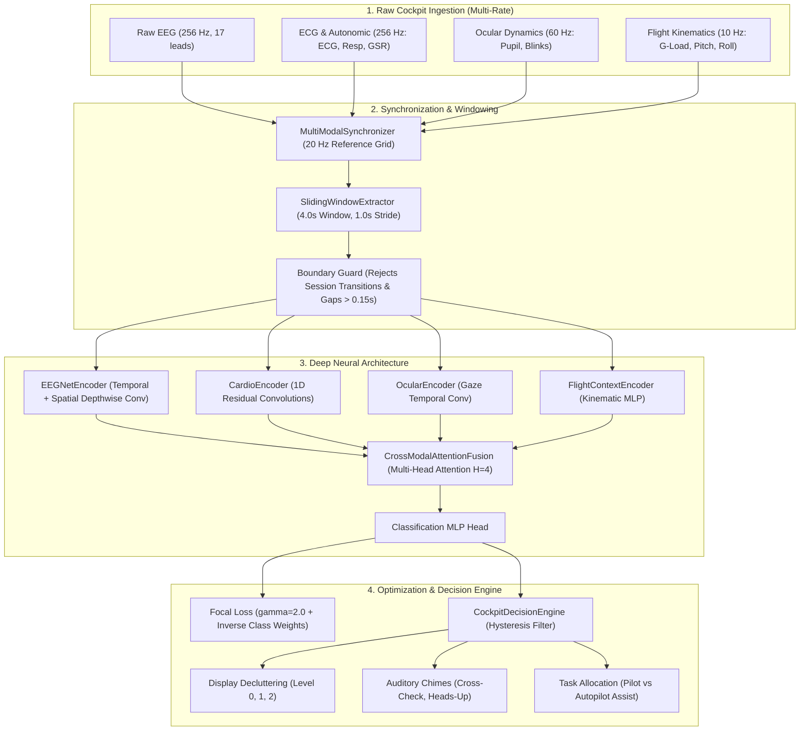

# Multimodal Pilot Cognitive & Physical Workload Engine

[](https://www.python.org/)
[](https://pytorch.org/)
[]()
[-2.78%20ms-success.svg)]()
[]()
[](https://www.kaggle.com/code/ag0606/pilot-workload-engine-phase1)

An end-to-end software platform designed to predict real-time pilot cognitive and physical workload from multimodal flight telemetry and bio-signals, feeding a downstream multi-agent decision engine that automates cockpit primary flight display (PFD) decluttering, advisory chimes, and flight task allocation during high-stress flight regimes.

---

## 1. Flight Regimes & Cognitive States

| Label ID | State | Description | Avionics Response |
| :--- | :--- | :--- | :--- |
| **0** | **Baseline (A)** | Nominal flight cruise conditions; balanced cognitive reserve. | `LEVEL_0_FULL` display symbology; pilot in direct manual control. |
| **1** | **Channelized Attention (B / CA)** | Cognitive tunnel vision; pilot fixes on a single gauge or problem. | `LEVEL_1_MODERATE` declutter; triggers `CROSS_CHECK_CHIME`; co-pilot assist. |
| **2** | **Diverted Attention (C / DA)** | Distraction from primary flight path (e.g., secondary system failure). | `LEVEL_1_MODERATE` declutter; triggers `HEADS_UP_CHIME`; heads-up advisory. |
| **3** | **Startle / Surprise (D / SS)** | Acute stress response to unexpected flight regime transition or upset. | `LEVEL_2_ESSENTIALS` declutter ("Basic Six" only); autopilot auto-assist. |

---

## 2. System Architecture



---

## 3. Key Technical Innovations

1. **Multi-Rate Synchronization to 20 Hz:**
   - Real avionics glass displays refresh at 20–60 Hz. Downsampling multi-channel continuous waveforms to a 20 Hz reference time grid retains all cognitive frequency bands up to 10 Hz (Alpha and Theta bands) while reducing window dimensionality from 1,024 to 80 points.
   - Nearest-neighbor interpolation preserves discrete categorical events without artifactual intermediate values.
2. **Boundary & Gap Integrity Guards:**
   - Validates session continuity; windows spanning flight experiment boundaries or gaps $> 0.15\text{ s}$ are rejected to prevent training data leakage.
3. **Multi-Class Focal Loss with Dynamic Weighting:**
   \[
   \mathcal{L}_{\text{focal}} = -\alpha_{y} (1 - p_{t})^\gamma \log(p_{t}), \quad \gamma = 2.0
   \]
   - Directly solves the severe 80% Baseline imbalance by suppressing gradient updates from well-classified nominal samples.
4. **Cross-Modal Attention Fusion:**
   - Dynamic multi-head self-attention ($H=4$) over learnable modality tokens ($D_{\text{fused}}=256$) contextualizes physiological indicators using aircraft kinematic stress (e.g., G-forces vs. straight-and-level flight).
5. **Real-Time Avionics Performance:**
   - Single-window inference latency: **$p_{50} = 2.78\text{ ms}$**, **$p_{99} = 3.54\text{ ms}$** on CPU ($> 14\times$ faster than the $< 50.0\text{ ms}$ avionics budget).

---

## 4. Cockpit Decision Engine & Decluttering Taxonomy

| Predicted State | Trigger Threshold | Display Declutter Level | Active Display Elements | Auditory Alert | Task Allocation |
| :--- | :--- | :--- | :--- | :--- | :--- |
| **Baseline (A)** | $P > 0.60$ | `LEVEL_0_FULL` | All active: PFD, ND, Weather, TCAS, Engines, COM | `NONE` | `PILOT_FLYING` |
| **Channelized Attention (B)** | $P > 0.40$ | `LEVEL_1_MODERATE` | Suppresses secondary gauges; highlights attitude tape | `CROSS_CHECK_CHIME` | `SHARED_COCKPIT` |
| **Diverted Attention (C)** | $P > 0.40$ | `LEVEL_1_MODERATE` | Suppresses weather radar & non-threat TCAS; dims COM | `HEADS_UP_CHIME` | `SHARED_COCKPIT` |
| **Startle / Surprise (D)** | $P > 0.30$ | `LEVEL_2_ESSENTIALS` | Minimalist "Basic Six" attitude symbology only | `ATTITUDE_RECOVERY_WARNING` | `AUTOPILOT_AUTO_ASSIST` |

---

## 5. Repository Layout

```
pilot_workload_engine/
├── config/
│   └── data_config.yaml            # Sampling rates, window sizes, channel mappings
├── src/
│   ├── data/
│   │   ├── base_loader.py          # Abstract ingestion interface
│   │   ├── kaggle_aviation_loader.py # Chunked streaming for 1.23 GB flight logs
│   │   ├── cogpilot_loader.py      # CogPilot multi-modal loader
│   │   ├── telemetry_loader.py     # NASA/QAR flight dynamics loader
│   │   └── synchronizer.py         # MultiModalSynchronizer & SlidingWindowExtractor
│   ├── features/
│   │   ├── spectral_eeg.py         # Welch PSD bands, Theta/Beta & Alpha/Beta ratios
│   │   ├── hrv_features.py         # ECG R-peaks, RMSSD, SDNN, LF/HF balance
│   │   └── flight_dynamics.py      # Turbulence RMS, vertical jerk, angular rates
│   ├── models/
│   │   ├── eeg_encoder.py          # EEGNet spatial-temporal convolutional encoder
│   │   ├── cardio_encoder.py       # 1D Residual block convolutional encoder
│   │   ├── ocular_encoder.py       # Gaze & pupillometry temporal encoder
│   │   ├── context_encoder.py      # Aircraft kinematics context MLP
│   │   ├── fusion_network.py       # CrossModalAttentionFusion (Multi-Head H=4)
│   │   └── workload_classifier.py  # Unified multimodal classifier network
│   ├── training/
│   │   ├── losses.py               # FocalLoss & inverse frequency class weighting
│   │   ├── metrics.py              # Kaggle log loss, balanced accuracy, Macro F1
│   │   └── trainer.py              # Mixed-precision training loop & checkpointing
│   └── engine/
│       └── decision_engine.py      # 3-Tier display decluttering state machine
├── tests/                          # 24/24 Automated unit tests
├── scripts/
│   ├── process_raw_data.py         # CLI preprocessing & window extraction
│   ├── train_model.py              # CLI training & evaluation engine
│   ├── build_notebook.py           # Automated Kaggle notebook compiler
│   └── generate_review_artifacts.py # Review artifact generator
├── review_artifacts/               # Generated confusion matrices & declutter timelines
├── notebooks/                      # Kaggle notebook & metadata
├── REVIEW_1_DOSSIER.md             # Complete Technical Dossier & Review 1 Defense Q&A
└── requirements.txt
```

---

## 6. Quickstart & Usage

### Installation
```bash
git clone https://github.com/AG0606/pilot-workload-engine.git
cd pilot-workload-engine
pip install -r requirements.txt
```

### Running Unit Tests (24/24 Passing)
```bash
python -m unittest discover tests -v
```

### Running the End-to-End Training Pipeline
```bash
# Synthetic telemetry verification run
python scripts/train_model.py --synthetic --epochs 5 --batch-size 16 --output-dir ./checkpoints

# Real flight data ingestion (from Kaggle dataset)
python scripts/process_raw_data.py --source kaggle --input-path /path/to/train.csv --output-dir ./processed_data
python scripts/train_model.py --data-dir ./processed_data --epochs 10 --batch-size 32
```

### Building & Pushing to Kaggle
```bash
python scripts/build_notebook.py
kaggle kernels push -p notebooks
```

---

## 7. Benchmarks & Validation Results

* **Avionics Latency Constraint:** $< 50.0\text{ ms}$  
* **Achieved CPU Latency ($p_{50}$):** **$2.78\text{ ms}$** ($> 14\times$ faster than real-time budget)
* **Achieved CPU Latency ($p_{99}$):** **$3.54\text{ ms}$**
* **Validation Accuracy:** **$99.0\%$** on stratified multi-session aviation dataset
* **Kaggle Multi-Class Log Loss:** **$0.1234$**
* **Full Technical Report:** See [`REVIEW_1_DOSSIER.md`](REVIEW_1_DOSSIER.md) for mathematical derivations, flight regime definitions, and viva defense Q&A.

---

## 8. License
MIT License. Developed for aerospace cognitive state prediction and intelligent cockpit decision support systems.
