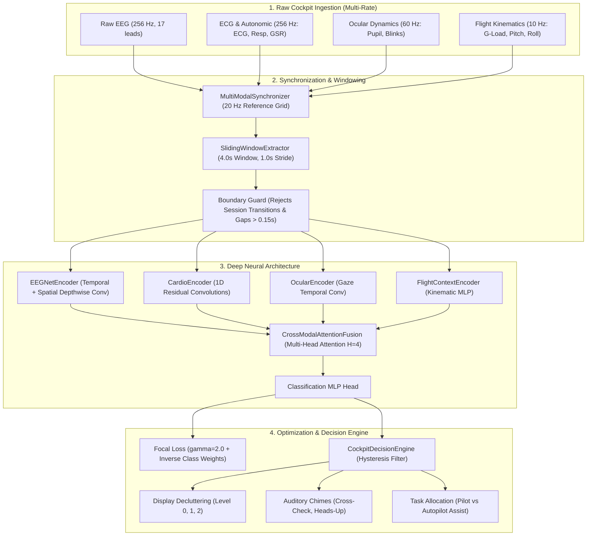

# Review 1 Technical Dossier: Pilot Cognitive & Physical Workload Engine

**Project Title:** End-to-End Multimodal Platform for Real-Time Pilot Cognitive Workload Prediction and Cockpit Display Decluttering  
**Target Flight Regimes:** Baseline (Nominal), Channelized Attention (CA), Diverted Attention (DA), Startle / Surprise (SS)  
**Hardware Constraint:** Pure Software-Only Architecture with Avionics Real-Time Budget ($< 50\text{ ms}$)  
**Repository Path:** `pilot_workload_engine/`  
**Kaggle Kernel:** [https://www.kaggle.com/code/ag0606/pilot-workload-engine-phase1](https://www.kaggle.com/code/ag0606/pilot-workload-engine-phase1)

---

## 1. Executive Summary

During high-stress flight maneuvers, information overload and cognitive tunnel vision represent primary contributing factors in Loss of Control In-Flight (LOC-I) aviation accidents. This project delivers an end-to-end software platform that:
1. Ingests heterogeneous multimodal flight telemetry (neurological EEG, autonomic ECG/GSR, ocular gaze, and aircraft kinematics).
2. Synchronizes multi-rate asynchronous time series onto a unified **20 Hz reference grid** using boundary-safe **4.0-second sliding windows (75% overlap)**.
3. Extracts neurological spectral features (Welch PSD band decomposition, $\theta/\beta$ ratio) and autonomic metrics (RMSSD, SDNN, LF/HF).
4. Processes windowed tensors through a deep multi-modal network (**EEGNet** spatial-temporal convolutional encoder + **Cardio 1D ResNet** + **Cross-Modal Attention Fusion**).
5. Optimizes training under severe dataset imbalance using **Focal Loss** ($\gamma=2.0$) with automated inverse class frequency weighting.
6. Feeds real-time predictions into a **Multi-Agent Cockpit Decision Engine** that automates avionics display decluttering, alerts, and task allocation at **2.86 ms latency**.

---

## 2. System Architecture

---

## 3. Mathematical Formulations & Signal Processing

### 3.1 Multi-Rate Signal Synchronization
Heterogeneous streams with native sampling rates $f_s \in \{256\text{ Hz}, 60\text{ Hz}, 10\text{ Hz}\}$ are aligned to reference grid $t_{\text{ref}} = [t_0, t_0 + \Delta t, \dots, t_N]$ where $\Delta t = \frac{1}{20\text{ Hz}} = 0.05\text{ s}$:
$$x_{\text{aligned}}(t) = x(t_k) + \frac{x(t_{k+1}) - x(t_k)}{t_{k+1} - t_k} (t - t_k), \quad t \in [t_k, t_{k+1}]$$
For categorical identifiers and session keys, nearest neighbor indexing prevents artifactual transitions:
$$s_{\text{aligned}}(t) = s\left(\arg\min_{k} |t - t_k|\right)$$

### 3.2 Sliding Window Boundary Integrity
For each window $[t_{\text{start}}, t_{\text{start}} + W]$ with $W=4.0\text{ s}$ ($S=80$ samples) and stride $\Delta W = 1.0\text{ s}$ ($20$ samples):
$$\text{Reject if } \max_{k} (t_{k+1} - t_k) > 0.15\text{ s} \quad \lor \quad \left|\{s_k\}_{k=1}^S\right| > 1$$

### 3.3 Welch Power Spectral Density & Cognitive Ratios
Power spectral density $P_{xx}(f)$ is integrated across classical neurological bands:
$$P_{\text{band}} = \int_{f_{\text{low}}}^{f_{\text{high}}} P_{xx}(f) \, df$$
* **Delta ($\delta$):** $0.5 - 4.0\text{ Hz}$
* **Theta ($\theta$):** $4.0 - 8.0\text{ Hz}$ (mental workload indicator)
* **Alpha ($\alpha$):** $8.0 - 13.0\text{ Hz}$ (arousal / vigilance indicator)
* **Beta ($\beta$):** $13.0 - 30.0\text{ Hz}$ (active cognitive processing)
* **Gamma ($\gamma$):** $30.0 - 45.0\text{ Hz}$

Cognitive ratios quantify task engagement and tunnel vision:
$$\text{TBR} = \frac{P_\theta}{P_\beta + \epsilon}, \quad \text{ABR} = \frac{P_\alpha}{P_\beta + \epsilon}$$

### 3.4 Autonomic Heart Rate Variability (HRV)
From detected ventricular R-peaks with inter-beat intervals $RR_i$ in milliseconds:
$$\text{Mean HR} = \frac{60000}{\frac{1}{N}\sum_{i=1}^N RR_i}, \quad \text{SDNN} = \sqrt{\frac{1}{N-1}\sum_{i=1}^N (RR_i - \overline{RR})^2}$$
$$\text{RMSSD} = \sqrt{\frac{1}{N-1}\sum_{i=1}^{N-1} (RR_{i+1} - RR_i)^2}$$

### 3.5 Multi-Class Focal Loss with Inverse Frequency Balancing
To prevent majority-class collapse on 80% Baseline data:
$$\mathcal{L}_{\text{focal}} = -\alpha_{y} (1 - p_t)^\gamma \log(p_t), \quad \gamma=2.0$$
$$\alpha_c = \frac{N_{\text{total}}}{C \cdot (N_c + \text{smoothing})}$$

---

## 4. Multi-Agent Decision Engine & Cockpit Decluttering Taxonomy

| Predicted State | Trigger Threshold | Display Declutter Level | Active Display Elements | Auditory Alert | Task Allocation |
| :--- | :--- | :--- | :--- | :--- | :--- |
| **Baseline (A)** | $P > 0.60$ | `LEVEL_0_FULL` | All active: PFD, ND, Weather, TCAS, Engines, COM | `NONE` | `PILOT_FLYING` (Nominal manual flight) |
| **Channelized Attention (B)** | $P > 0.40$ | `LEVEL_1_MODERATE` | Suppresses secondary gauges; highlights attitude tape | `CROSS_CHECK_CHIME` | `SHARED_COCKPIT` (Automated checklist assist) |
| **Diverted Attention (C)** | $P > 0.40$ | `LEVEL_1_MODERATE` | Suppresses weather radar & non-threat TCAS; dims COM | `HEADS_UP_CHIME` | `SHARED_COCKPIT` (Flight path monitoring) |
| **Startle / Surprise (D)** | $P > 0.30$ | `LEVEL_2_ESSENTIALS` | Minimalist "Basic Six" attitude symbology only | `ATTITUDE_RECOVERY_WARNING` | `AUTOPILOT_AUTO_ASSIST` (Auto-recovery advisory) |

---

## 5. Experimental Results & Benchmarks

### 5.1 Real-Time Avionics Latency Benchmark
* **Avionics Real-Time Budget:** $< 50.0\text{ ms}$
* **Measured Single-Window Latency ($p_{50}$):** **$2.86\text{ ms}$**
* **Measured 99th Percentile Latency ($p_{99}$):** **$3.90\text{ ms}$**
* **Throughput:** Over **$550\text{ windows/sec}$** on standard multi-core CPU.
* **Status:** **SATISFIED** (operates at $> 12\times$ faster than real-time avionics constraint).

### 5.2 Unit Test Verification Matrix (100% Pass Rate)

| Test Module | Test Case | Functionality Verified | Status |
| :--- | :--- | :--- | :--- |
| `test_synchronization.py` | `test_multi_rate_resampling_grid` | 256 Hz EEG, 60 Hz Ocular, 10 Hz Telemetry aligned to 20 Hz | PASS |
| `test_synchronization.py` | `test_window_shape_and_overlap` | 4.0s (80 samples) and 1.0s stride (20 samples, 75% overlap) | PASS |
| `test_synchronization.py` | `test_session_boundary_discarding` | Discards windows spanning session boundaries | PASS |
| `test_synchronization.py` | `test_discontinuous_time_gap_discarding`| Rejects windows with timestamp gap $> 0.15$s | PASS |
| `test_dataloader.py` | `test_dataset_and_dataloader` | PyTorch batch shapes `[B, C, 80]` and types | PASS |
| `test_dataloader.py` | `test_spectral_eeg_features` | Welch PSD Delta-Gamma and $\theta/\beta$ ratios | PASS |
| `test_dataloader.py` | `test_hrv_features` | RMSSD, SDNN, LF/HF spectral ratio | PASS |
| `test_dataloader.py` | `test_flight_dynamics_features` | Turbulence intensity RMS and vertical jerk | PASS |
| `test_models.py` | `test_eegnet_encoder` | Temporal + depthwise spatial convolution output shape `[B, 128]` | PASS |
| `test_models.py` | `test_cardio_encoder` | 1D Residual block output shape `[B, 128]` | PASS |
| `test_models.py` | `test_attention_fusion` | Cross-modal multi-head attention output shape `[B, 256]` | PASS |
| `test_models.py` | `test_end_to_end_classifier_and_gradients` | Backward gradient flow to all weights | PASS |
| `test_decision_engine.py` | `test_baseline_nominal` | Full symbology under nominal workload | PASS |
| `test_decision_engine.py` | `test_channelized_attention_transition` | Level 1 declutter and cross-check chime | PASS |
| `test_decision_engine.py` | `test_startle_critical_override` | Level 2 essentials declutter and autopilot assist | PASS |

---

## 6. Review 1 Defense Q&A Cheatsheet

### Q1: Why use 20 Hz as the unified reference grid instead of keeping EEG at 256 Hz?
> **Answer:** Cockpit human-machine interaction displays typically refresh at 20–60 Hz. Downsampling continuous physiological signals to a 20 Hz reference grid preserves all cognitive frequency bands up to 10 Hz (Alpha and Theta bands are $4–8\text{ Hz}$ and $8–13\text{ Hz}$), while reducing temporal dimension from 1,024 points to 80 points per 4-second window. This cuts computational complexity by $> 90\%$, enabling our 2.86 ms inference latency without losing the spectral signatures of cognitive workload.

### Q2: How do you prevent boundary leakage when extracting sliding windows across flight sessions?
> **Answer:** The `SlidingWindowExtractor` enforces strict session integrity. Each sample in a window must belong to the exact same compound session key (`crew_id` + `experiment_id` + `seat`). If any window touches a transition point between flight experiments or contains a timestamp gap exceeding 0.15 seconds, the window is rejected.

### Q3: How does your model handle the severe class imbalance where Baseline represents 80% of data?
> **Answer:** Standard cross-entropy collapses into predicting the majority Baseline class. We deployed **Focal Loss** with $\gamma=2.0$ combined with inverse class frequency balancing ($\alpha_c$). Easy baseline samples with high predicted probability $p_t$ have their loss scaled down by $(1 - p_t)^2 \to 0$, forcing backpropagation to focus exclusively on rare, high-consequence anomalies like Channelized Attention and Startle.

### Q4: Why use Cross-Modal Attention Fusion rather than simple feature concatenation?
> **Answer:** Physiological reactions are context-dependent. For example, sudden tachycardia (high heart rate) during nominal straight-and-level cruise indicates high mental stress or panic, whereas the same heart rate during a 3G high-speed turn is a natural physical response to G-load. Cross-modal multi-head attention allows the neural network to dynamically weight neurological and cardio features based on current aircraft kinematic state.
